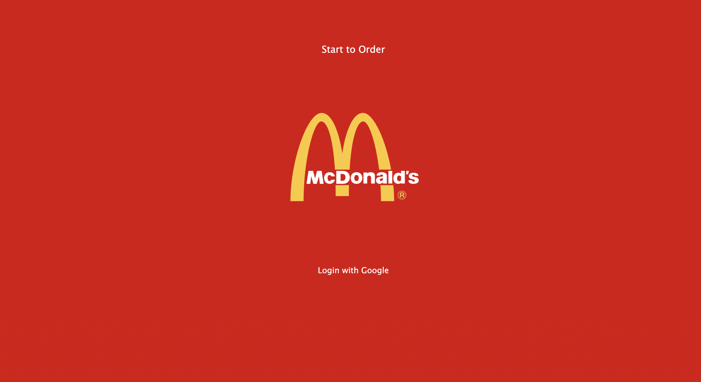

# MacDonald Ordering

## Description

The website offers different foods to the user, with the user to have the option to order the food and editing and also deleting the order

### Screen shot

## Technologies used

- [HTML](https://www.w3schools.com/html/)
- [CSS](https://www.w3schools.com/cssref/)
- [JavaScript](https://developer.mozilla.org/en-US/)
- [Express](https://expressjs.com/)
- [MongoDB](https://www.mongodb.com/)
- [Google Oauth](https://developers.google.com/identity/protocols/oauth2)
- [Google Fonts](https://fonts.google.com/)

### Getting Started

To see this app, [click here](https://macdonald-generalassembly.herokuapp.com/)

### Trello

[macDonald Trello](https://trello.com/b/8J7W7OJP/ga-project)

## Next Steps

- [ ] To calculate the overall price in checkout.
- [ ] To add mobile friendly style.
